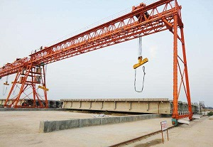

### 综合项目 ： 控制系统综合设计 （20分）

---

**注意：** 该项目只针对正常参与该课程环节的同学 

---
**内容：**

龙门吊，又称为门式起重机，是桥式起重机的一种变形；主要用于室外的货场、料场货、散货的装卸作业。龙门吊具有场地利用率高、作业范围大、适应面广、通用性强等特点，在港口货场得到广泛使用。

其工作原理是起重小车在主梁上来回移动，从而带动货物移动，改变货物的位置；依据其工作原理，可将其简化如下图所示：

其中，$$F$$为控制作用力，$$x$$为起重小车移动的距离；$$\theta$$为重物摆动产生的摆角。连接起重小车与中午到绳索长度为$$l=5m$$，质量为$$m_{2}=1kg$$。起重小车质量为$$M=50kg$$，货物质量为$$m_{1}=100kg$$。

---
**任务1：**

1、建立系统模型，分析控制作用力$$F$$为输入，小车位移$$x$$为输出的子系统；运用课程所学，分析系统性能（时域、频域等）；并为系统设计反馈控制器，提高系统性能。

2、建立系统模型，分析控制作用力$$F$$为输入，载荷位移$$x+sin(\theta)$$为输出的子系统；运用课程所学，分析系统性能（时域、频域等）；并为系统设计反馈控制器，提高系统性能。

---

