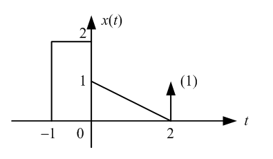

# 《信号与系统》课程作业1 （5分）

**要求：** 请使用**A4大小信笺纸**完成作业，信笺纸写明姓名、学号和班级；完成后交由班长/学习委员在截止日前统一提交作业。

**截止日期：** 2019年3月22日前

**作业相关内容：** 信号时域分析

---

1.利用冲激信号的性质计算下列各式：

  a) $$\int _ { - \infty } ^ { \infty } \delta ( t - 2 ) \mathrm { e } ^ { - 2 t } u ( t ) \mathrm { d } t$$
  
  b) $$\int _ { - 4 } ^ { + 3 } \mathrm { e } ^ { - t } \cdot \delta ( t - 6 ) \mathrm { d } t $$
  
  
2.若信号$$x(t)$$的波形如下图所示，用基本信号描述该信号，并请绘制$$x(-2t+8)$$的波形信号；

3.已知信号序列$$x _ { 1 } [ k ] = \{ - 1,1,0 , \dot { 2 } , 1,0 , - 1 \} , \quad x _ { 2 } [ k ] = \{ 1,2 , \dot { 3 } , - 1 , - 1 \}$$,试绘制$$y _ { 1 } [ k ] = x _ { 1 } [ 2 k ] + x _ { 2 } [ 3 k + 1 ]$$和 $$y _ { 2 } [ k ] = x _ { 1 } [ k + 1 ] + x _ { 2 } [ - k ]$$的波形；

4.请描述阶跃信号、斜坡信号、冲激信号和冲击偶信号之间的关系；

---

